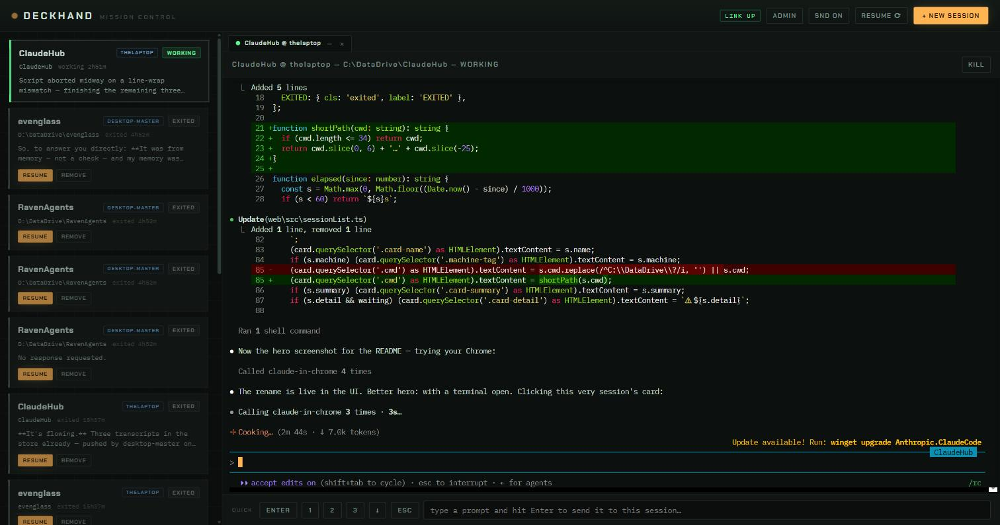

# Deckhand

 



A self-hosted **fleet controller for coding-agent sessions** — Claude Code and
OpenAI Codex, side by side. Run agent sessions on any of your computers, watch
and drive all of them from one dashboard (or your phone), and let projects and
conversations follow you between machines. No cloud service, no accounts, no configuration files to
maintain — machines discover each other and the fleet assembles itself.

Deckhand grew out of a simple dashboard whose only job was to make sure you
never miss the moment a session stops and waits for you. That job still comes
first: cards are sorted waiting-first, and every dashboard everywhere chimes
when any session on any machine needs a human.

---

## What it does

- **Mixed agents.** Claude Code and Codex sessions live in the same session
  list and tab bar. The launch dialog offers whichever CLIs are installed on
  the machine you pick, with that agent's own model and permission choices.
  Status, resume, cross-machine migration, the durable transcript store and
  PRINT export work for both. Each agent is an adapter under `server/agents/`,
  so a third CLI is one file away.
- **Hand a session to another engine.** HAND OFF on any card moves the work
  to a different engine, machine and/or folder, including a brand-new folder.
  Not a transcript transplant (each agent's log is its own private replay
  format): the departing agent is asked to write a brief for its successor,
  the hub appends the conversation as plain dialogue, drops both into the
  target folder as `.deckhand/handoff.md`, and starts the target engine with
  "read it, then continue". The new card shows where it came from.
- **One dashboard, whole fleet.** Every machine runs the same hub; every hub
  shows every machine's sessions. Open `http://<any-machine>:5959` from any
  device on your tailnet — they are all equivalent.
- **Full terminals in the browser.** Each session runs in a real PTY. The
  server keeps a headless terminal mirror per session, so opening a terminal
  (from any machine) restores a pixel-perfect snapshot — no replay garbling.
  Terminals open as tabs: click to switch, `–` to soft-close (session keeps
  running), `×` to end.
- **Sessions survive everything.** Close the browser, reboot the machine,
  kill the process — the conversation is durable. EXITED cards resume with
  full history.
- **Work follows you.** Resume any conversation on any machine. If the
  project folder isn't there, it replicates first (through the always-on
  home machine); the transcript ships along and is re-homed for the local
  path; the resumed session is told its folder moved so it doesn't trip on
  old absolute paths.
- **On-use folder sync.** Nothing replicates until a session touches a
  folder. From then on it syncs continuously (file-watch, seconds) to the
  home machine, which keeps the canonical copy plus 30 days of per-file
  version history.
- **Durable conversation store.** Every hub continuously pushes transcripts
  to the home machine. Conversations outlive their origin machine, local
  retention cleanup, and folder moves — the resume dialog backfills from the
  store when no machine can offer a copy.
- **Fleet auto-update.** Publish a build to the home machine; every hub sees
  it and updates itself from the ADMIN panel (or its 6-hour self-check).
  Dev checkouts (build 0) never auto-update.
- **Console-first workflow if you want it.** The `deckhand` CLI spawns
  hub-owned sessions bridged into your real terminal, tmux-style: `Ctrl+Q`
  detaches, the session lives on, reattach from anywhere — including a
  session running on another machine.
- **Concurrency guard.** Opening a folder that has a live session on another
  machine asks for confirmation first — two agents editing one folder can
  overwrite each other.
- **Phone-friendly.** On narrow screens the session list is the screen and
  terminals open as a full-screen overlay with a back button and thumb-sized
  quick-answer keys.

## What it is not

- Not multi-user. There is no login system; the trust boundary is your
  private network (see Security).
- Not a CI runner or an agent framework. It hosts and moves interactive
  sessions; the sessions themselves are stock Claude Code or stock Codex.

---

## Architecture in one page

Every machine runs the same **hub** (Node + Express + node-pty). Hubs are
peers; there is no controller. Three subsystems ride on that:

```
                 ┌──────────────── tailnet (WireGuard) ───────────────┐
                 │                                                    │
   ┌─────────┐  discovery: probe tailnet devices on :5959-5969  ┌─────────┐
   │  hub A  │◄────────────────────────────────────────────────►│  hub B  │
   │ (laptop)│  federation: control WS + terminal proxy + REST  │(desktop)│
   └────┬────┘                                                  └────┬────┘
        │                                                            │
        │        ┌──────────────────────────────────────┐            │
        └───────►│         home machine (hub C)         │◄───────────┘
                 │  e.g. a $5 VPS, or any always-on box │
                 │  • Syncthing canonical folder copies │
                 │  • durable transcript store          │
                 │  • release shelf for auto-update     │
                 └──────────────────────────────────────┘
```

- **Discovery** — each hub asks the local Tailscale daemon for the device
  list every 60 s and probes each online device for `/api/hub-info`.
  Finding a sibling → one outbound control WebSocket. Zero configuration;
  new machines appear on every dashboard within a minute.
- **Federation** — session lists are merged (tagged by machine), actions
  (spawn / kill / resume) are forwarded to the owning hub, and terminal
  WebSockets are proxied transparently. Peers that drop stay visible as
  UNREACHABLE cards with cached state; sessions themselves never depend on
  the links.
- **Home machine** — by convention a machine named `vps-node` (override with
  env vars, below). It is an ordinary fleet member that happens to never
  sleep, and it hosts the three durable stores. Any always-on machine works.

### Status detection

Four signals fused with precedence (higher wins, 3-second shield):

1. PTY exit → EXITED
2. **Agent hooks.** Claude Code: injected per-session via `--settings`, no
   changes to your global settings — UserPromptSubmit → WORKING,
   AskUserQuestion → WAITING_QUESTION, Stop → IDLE, permission notification
   → WAITING_PERMISSION. Codex: the hub keeps its own entries in
   `~/.codex/hooks.json` (yours are preserved) and launches with
   `--dangerously-bypass-hook-trust` so they run without the per-hook review
   prompt — UserPromptSubmit → WORKING, PermissionRequest →
   WAITING_PERMISSION, Stop/Interrupt → IDLE. Codex mints its own
   conversation id; the SessionStart hook reports it and the hub binds it to
   the card it just launched.
3. `~/.claude/sessions/*.json` watcher — Claude Code's own status feed.
4. Output heuristics — fallback until the first hook arrives; each agent
   contributes its own prompt patterns.

Codex conversations are found through the `threads` table of
`~/.codex/state_*.sqlite` (read with Node's built-in sqlite) and live as
rollout files under `~/.codex/sessions/`. Moving one to another machine is a
file copy — Codex rebuilds its index on resume. The first launch in a folder
would ask Codex's "do you trust this directory?" question; the hub records the
yes answer in `~/.codex/config.toml` beforehand, the same way pressing Yes does.

Alerts fire only after a state persists 1.5 s. They reach every connected
dashboard (chime + tab badge). There are deliberately no desktop toasts.

---

## Requirements

| What | Why | Notes |
|---|---|---|
| Windows 10/11 or Linux | hub runs on both | macOS untested |
| [Tailscale](https://tailscale.com) (free) | discovery, transport, trust boundary | required for any multi-machine features |
| Node.js 20+ | runs the hub | `winget install OpenJS.NodeJS.LTS` / distro package |
| [Claude Code](https://claude.com/claude-code) | the sessions themselves | logged in on each machine that runs sessions |
| [Codex CLI](https://developers.openai.com/codex) | optional second agent | `npm i -g @openai/codex`, logged in; machines without it simply don't offer it |
| [Syncthing](https://syncthing.net) (free) | folder replication | optional — skip it and everything but folder sync works |

A single machine with none of the above except Node + Claude Code still
works as the original standalone dashboard.

---

## Install (each machine)

1. **Join the tailnet** — install Tailscale, sign in. Give servers a
   friendly hostname (`tailscale up --hostname mybox`).
2. **Get the code** — extract a release tgz, or `git clone`. Then:
   ```
   npm install
   ```
3. **Set the projects root** (where your project folders live, and where
   fleet folders materialize). Windows: create `hub-env.cmd` next to
   `start-hub.cmd`:
   ```
   set HUB_PROJECTS_ROOT=D:\Projects
   ```
   Linux: pass `HUB_PROJECTS_ROOT` to the installer (defaults `/srv/sync`).
4. **Install the always-on runner:**

   **Windows** — one installer, two modes (it asks if you don't pick):
   ```
   powershell -ExecutionPolicy Bypass -File scripts\install.ps1 -Mode startup
   powershell -ExecutionPolicy Bypass -File scripts\install.ps1 -Mode service -Account .\<you>
   powershell -ExecutionPolicy Bypass -File scripts\install.ps1 -Uninstall
   ```
   - `startup` — scheduled task at logon. No password, no admin, works with
     Microsoft-account/PIN sign-ins, auto-restarts on crash. Runs in your
     interactive session. Recommended default.
   - `service` — NSSM Windows service. Starts at boot before login; requires
     an elevated shell and a **local-account** password (Microsoft-account
     sign-ins usually reject service logon — either switch the account to
     local sign-in or use `startup` mode).

   **Linux** (systemd; also how updates apply):
   ```
   sudo bash scripts/install.sh
   sudo bash scripts/install.sh --uninstall
   ```
5. **Windows firewall**: when first run interactively, click **Allow** on
   the prompt. Services get no prompt — if other machines can't reach this
   hub, add the rule once (elevated):
   ```
   New-NetFirewallRule -DisplayName Deckhand -Direction Inbound -Action Allow -Protocol TCP -LocalPort 5959-5969
   ```
6. Open `http://127.0.0.1:5959`. Within a minute every other dashboard in
   the fleet shows this machine, and vice versa.

### Enabling folder sync (once per fleet)

Install Syncthing on each machine that should sync (`winget install
Syncthing.Syncthing`, run with `--no-console --no-browser`; `apt install
syncthing` + `systemctl enable --now syncthing@<user>` on Linux).

On the **home machine**, bind its Syncthing API to the tailnet and write the
hub's sync config `data/sync.json`:

```json
{
  "local": { "url": "http://127.0.0.1:8384",        "apiKey": "<its syncthing api key>", "deviceId": "<its device id>" },
  "vps":   { "url": "http://<home-tailnet-ip>:8384", "apiKey": "<same>",                 "deviceId": "<same>", "folderRoot": "/srv/sync" }
}
```

(on the home machine itself `local` and `vps` are the same endpoint).
Every **other** machine needs nothing: a hub without `data/sync.json` asks a
fleet peer for the home endpoint, reads its own local Syncthing credentials,
and writes its own config within a minute or two of starting.

API keys live in Syncthing's `config.xml` (`%LOCALAPPDATA%\Syncthing` on
Windows, `~/.local/state/syncthing` on Linux). Device pairing, folder
registration, ignore patterns (`node_modules` etc.) and versioning are all
managed by the hubs — never configure folders in the Syncthing GUI by hand.

---

## Using it

### Dashboard

- **Cards** (left) — every session in the fleet, machine-tagged, sorted by
  urgency: WAITING first, then IDLE, WORKING, EXITED. Cards show elapsed
  time in state and the last assistant message.
- **Terminal tabs** (right) — click a card to open its terminal as a tab.
  `–` (or middle-click) closes the tab and leaves the session running; `×`
  ends the session (it stays resumable). On another machine's session,
  keystrokes are proxied through the mesh — there is no difference in use.
- **Quick answers** — `ENTER / 1 / 2 / 3 / ↓ / ESC` buttons and a one-line
  prompt box under the terminal, for triaging permission prompts without
  clicking into the terminal.
- **Drag & drop** — drop files onto the terminal panel; they upload to that
  session's machine and the saved path is typed into the prompt (browsers
  can't reveal real file paths — the hub bridges that).
- **+ NEW SESSION** — pick machine, folder (listed from that machine),
  permission mode, model, optional first prompt.
- **RESUME ⟳** — the fleet resume dialog: pick the machine that will *run*
  the session, optionally filter by *source* machine, pick a folder
  (badged LOCAL / ON VPS / on other machines, with live-session warnings),
  pick one of its conversations (merged from every machine plus the durable
  store, newest first). If the folder isn't on the target, you watch it
  materialize: *source pushing → pulling → transferring conversation →
  starting*.
- **ADMIN** — per-machine version, build, uptime; check for updates; UPDATE
  and RESTART buttons that work across the fleet from any dashboard.

### The `deckhand` CLI

Put `cli/` on your PATH (`hubclaude` remains as a legacy alias).

```
deckhand                  spawn a hub-owned session in the current directory and attach
deckhand attach <name>    attach to a running session — any machine in the fleet
deckhand ls               list fleet sessions
```

`Ctrl+Q` detaches; the session keeps running and is also visible in every
dashboard (both can be attached at once — keystrokes merge live). Set
`HUB_URL` if your hub is not on `127.0.0.1:5959-5969`.

### Publishing updates (the machine you develop on)

```
powershell -File scripts\publish.ps1
```

Builds the frontend, stamps `version.json` (semver + git commit count as a
monotonic build number), tars the tree, uploads to the home machine's
release shelf. Every hub notices within 6 hours, or immediately via
ADMIN → CHECK FOR UPDATES. Applying: Windows hands off to a detached runner
(swap files, `npm install`, relaunch — or let the service manager relaunch);
Linux extracts in place and exits for systemd to restart. A dev checkout
(no `version.json` → build 0) reports `DEV` in ADMIN and never auto-updates.

---

## Configuration reference

All optional; set in the environment (`hub-env.cmd` on Windows, the systemd
unit on Linux).

| Variable | Default | Meaning |
|---|---|---|
| `HUB_PORT` | `5959` | listen port; if taken, walks up to +10 (fleet probes 5959–5969) |
| `HUB_PROJECTS_ROOT` | `C:\DataDrive` / `/srv/sync` | where projects live and fleet folders materialize; the hub refuses to materialize folders if it doesn't exist |
| `HUB_DATA_DIR` | `<repo>\data` | runtime state (below) |
| `HUB_STORE_MACHINE` | `vps-node` | fleet machine holding the durable transcript store |
| `HUB_UPDATE_MACHINE` | `vps-node` | fleet machine holding the release shelf |
| `DECKHAND_SERVICE` | unset | set by service installers; tells the hub a supervisor handles relaunches |
| `HUB_URL` | probe localhost | `deckhand` CLI: explicit hub address |

`data/` contents: `hub-hooks.json` (generated hook settings injected into
sessions), `hub-sessions.json` (resume records for EXITED cards),
`sync.json` (Syncthing endpoints — contains API keys, never commit),
`drops/` (drag-and-drop uploads), `hub.log` (launcher-captured output),
`transcripts/` (the durable store, home machine), `releases/` (release
shelf, home machine), `update.tgz` + `update-runner.cmd` (transient, during
updates).

---

## Security model

Read this section before port-forwarding anything.

- The dashboard **executes commands on your machines** by design — treat
  access to it as shell access to the entire fleet.
- The hub binds `0.0.0.0` but accepts only: loopback, the machine's own
  interface addresses, and tailnet sources (`100.64.0.0/10`,
  `fd7a:115c:a1e0::/48`). LAN and internet sources get 403 / dropped.
  **The tailnet is the trust boundary**: any device you admit to your
  tailnet can drive your fleet. Don't admit guests.
- There is no application-level auth and no TLS (WireGuard encrypts
  transit). Never expose the port publicly; if you want access from
  browsers outside the tailnet, put an authenticating proxy (e.g.
  Cloudflare Tunnel + Access) in front — the hub itself should stay
  unreachable from the internet.
- Syncthing API keys in `data/sync.json` grant control of file sync; the
  file is gitignored — keep it that way.

## Known gotchas (all discovered the hard way)

| Symptom | Cause / fix |
|---|---|
| Tailnet dead while a commercial VPN is on | VPN clients (NordVPN etc.) claim the `100.64/10` range or block non-VPN traffic. Disconnect, or scope the VPN to selected apps (split tunneling). Their "Meshnet"-type features conflict permanently — keep them off. |
| Machine reachable but hub isn't | Windows firewall blocking inbound for the service context — add the port rule (Install §5). |
| Service "Running" but hub dead, or crash-looping | Look at `data/hub.log` (Windows) / `journalctl -u deckhand` (Linux). If the service logon account is wrong, NSSM runs but the app dies instantly. |
| Two hubs on one machine, port walked to 5960 | Two supervisors installed (startup task **and** service). Keep one; the installer warns and cleans up its own kind. |
| Service Log On rejects your Microsoft-account password | MSA/PIN sign-ins usually can't do service logon. Use `startup` mode, or switch Windows to local-account sign-in. |
| Resume dialog shows a folder but no conversations | Conversations attached to a **live** session are hidden (resuming them would fork). EXITED sessions' conversations show normally. |
| Migrated session talks about old paths | It's oriented automatically on migration; for old sessions just tell it the folder moved. |
| Old transcripts vanish | Claude Code prunes them (default ≈30 days). Deckhand's store keeps its copies forever; also consider `"cleanupPeriodDays": 3650` in `~/.claude/settings.json`. |

## Development

```
npm run dev      # tsx watch server + vite dev server on :5960 (proxies to :5959)
npm run build    # vite build → server/public (what npm start serves)
npx tsc --noEmit && npx tsc -p web --noEmit   # typecheck both sides
```

Layout:

- `server/` — `index.ts` (HTTP/WS API, wiring), `sessionManager.ts` (PTYs +
  headless terminal mirrors), `statusEngine.ts` (signal fusion),
  `discovery.ts` (tailnet probing), `federation.ts` (peer connections,
  merged sessions, forwarding), `syncthing.ts` (on-use folder sync driver),
  `fleetFolders.ts` (folder + conversation index), `fleetResume.ts`
  (cross-machine resume jobs), `transcriptStore.ts` (durable store +
  pusher), `updater.ts` + `version.ts` (auto-update), `hooksReceiver.ts`,
  `claudeSessionsWatcher.ts`, `transcripts.ts`, `conversations.ts`,
  `persistence.ts`, `config.ts`.
- `web/` — vite vanilla-TS frontend (xterm.js): `main.ts`, `sessionList.ts`,
  `terminalView.ts`, `resumeDialog.ts`, `newSessionDialog.ts`,
  `adminDialog.ts`, `quickAnswers.ts`, `styles.css`.
- `cli/deckhand.mjs` — terminal attach client.
- `hooks/hub-hooks.template.json` — hook settings injected into sessions.
- `scripts/` — `install.ps1`, `install.sh`, `publish.ps1`, `vps-bootstrap.sh`.

## License

Apache License 2.0 — Copyright 2026 Cristian Mori. See [LICENSE](LICENSE).
